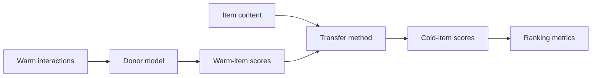

# Concepts

warm-transfer is easiest to understand as a post-hoc layer over an already trained recommender.

## Core idea

The donor model learns personalization on warm items. A transfer method learns how item content maps
to those donor scores and applies that mapping to cold-start items. The donor is not retrained.

## Read next

- [Why warm-transfer](why.md): the use case and mental model.
- [Popularity bias & Grouped MP](popularity-bias.md): the main failure mode of naive transfer.
- [Method families](methods-families.md): which methods exist and when to try them.
- [Evaluation protocol](../eval-protocol.md): how the benchmark avoids cold-start leakage.
