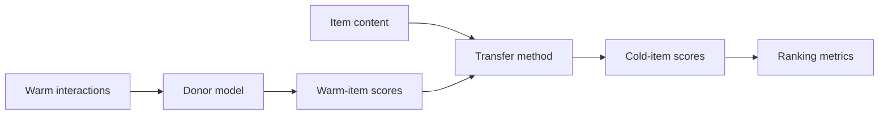

# Концепции

warm-transfer проще всего понимать как post-hoc слой поверх уже обученного рекомендателя.

## Core idea

Donor model учит персонализацию на warm items. Transfer method учит, как item content отображается в
донорские скоры, и применяет это отображение к cold-start items. Донор не переобучается.

## Читать дальше

- [Зачем warm-transfer](why.md): use case и mental model.
- [Популярность и Grouped MP](popularity-bias.md): главный failure mode наивного transfer.
- [Семейства методов](methods-families.md): какие методы есть и когда их пробовать.
- [Evaluation protocol](../eval-protocol.md): как бенчмарк избегает cold-start leakage.
